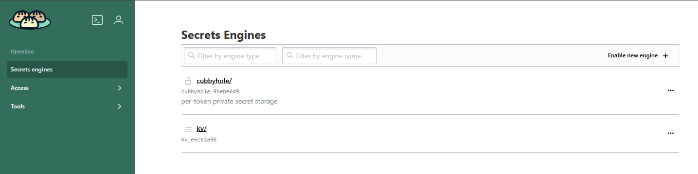
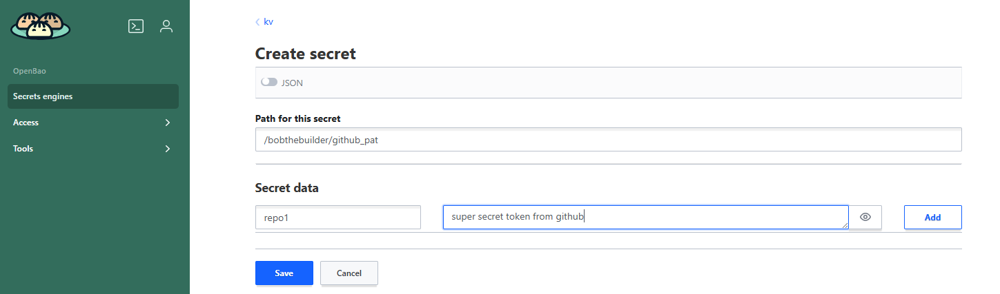

# Secret Manager

CIRRUS hosts a secrets manager called OpenBao that is available to UCAR employees via a WebUI. 

## Adding a secret to NCAR OpenBao

- Navigate to https://bao.k8s.ucar.edu, change the authentication method to LDAP, and log in with your UCAR username/password
- You will be brought to a screen that resembles this

- Choose `kv` (key/value)
- In the upper right choose the `Create Secret` button
- Path for secret: `<your ucar username>/<new secret>`
- You can store multiple key/value pairs under each secret. 
- Set the key to be a short description of the secret that will be used to reference it and set the value to the actual secret

- Save the secret

## Updating an existing OpenBao secret

You may need to update your secret in order to follow best practices when managing sensitive information and keeping up with rotating them accordingly.

- Login to OpenBao as defined above
- Once in the `kv` screen list your secrets by entering `<username>/` in the view secret box
- You should see a list of your secrets
- Edit the secret and add a new key/value token as defined above

## Next Steps

Secrets in OpenBao will be configured to automatically sync to the Cirrus infrastructure and be accessible by your container images.